# 025 基于Python的二氧化碳排放量数据分析系统-设计展示

> **代码有偿获取 可接受定制 微信联系方式: ACE2487，备注(BS)**

> 

## 介绍

基于Python的二氧化碳排放量数据分析系统，通常使用的技术栈包括Python、Django、Vue、Scrapy、Echarts等。其中，Python是主要编程语言，Django是Python的Web框架，Vue是前端开发框架，Scrapy是爬虫框架，Echarts是数据可视化库。

该系统的主要功能包括：
1. 省级碳排放数据的获取和展示。该系统可以从国际上公认的碳排放量标准IPCC中获取历年各省碳排放数据，并进行展示和可视化。
2. 碳排放分布中国地图可视化。该系统可以将各省的碳排放数据进行可视化展示，呈现在中国地图上，方便用户观察全国范围内的碳排放情况。
3. 燃料排放量河流图分析。该系统可以对各种燃料类型的排放量进行比较分析，并用河流图展示，让用户更加直观地了解不同燃料类型对碳排放的影响。
4. 各行业碳排放分析。该系统可以对不同行业的碳排放情况进行分析，并用饼图等方式展示，让用户了解各行业的碳排放占比情况。
5. 后台管理碳排放数据。该系统还支持后台对碳排放数据进行管理，包括数据的添加、修改、删除等操作，以确保数据的准确性和完整性。

## 技术栈

python django vue scrapy echarts 数据分析可视化 省级碳排放 IPCC 历年各省碳排放数据 碳排放分布中国地图可视化 燃料排放量河流图分析 各行业碳排放分析 行业碳排放占比 后台管理碳排放数据 环保

## 视频

> **点击查看 \>\>\> [https://www.bilibili.com/video/BV1FL41197PU/](https://www.bilibili.com/video/BV1FL41197PU/)**

## 截图

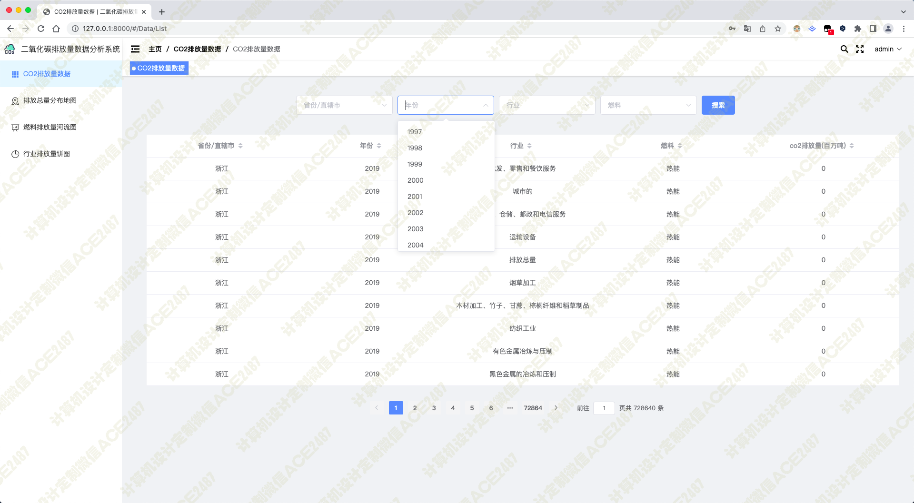
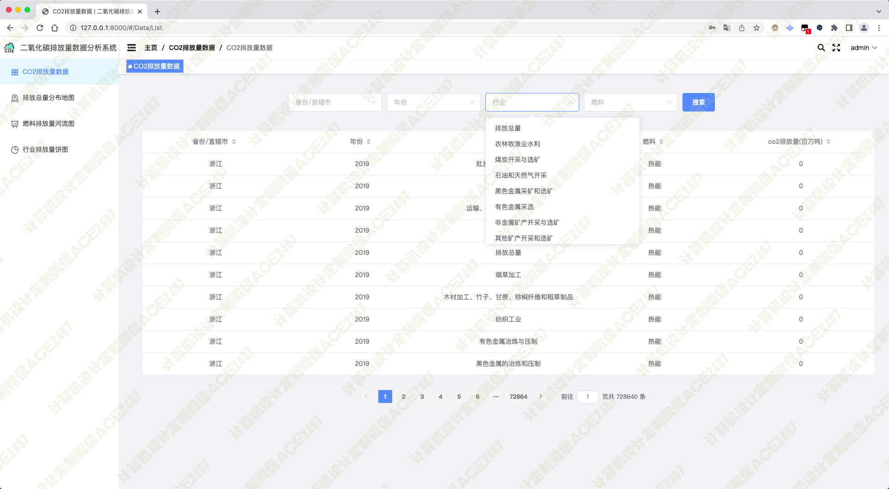
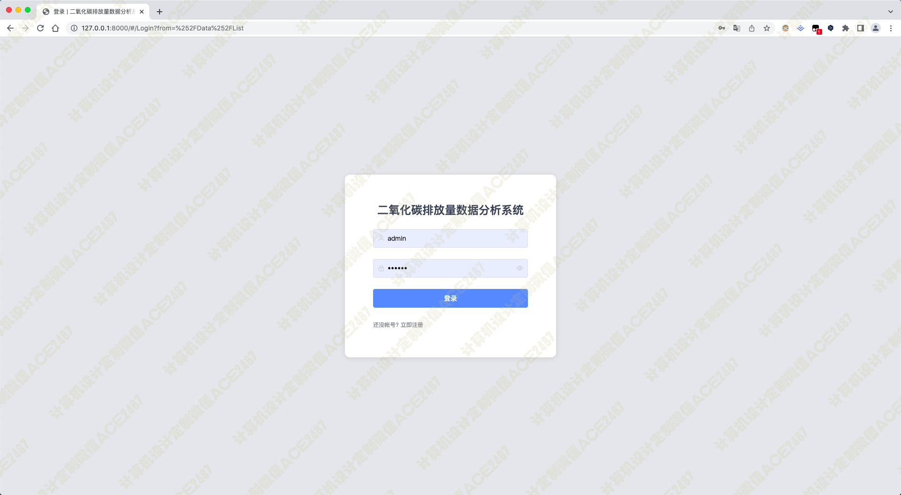
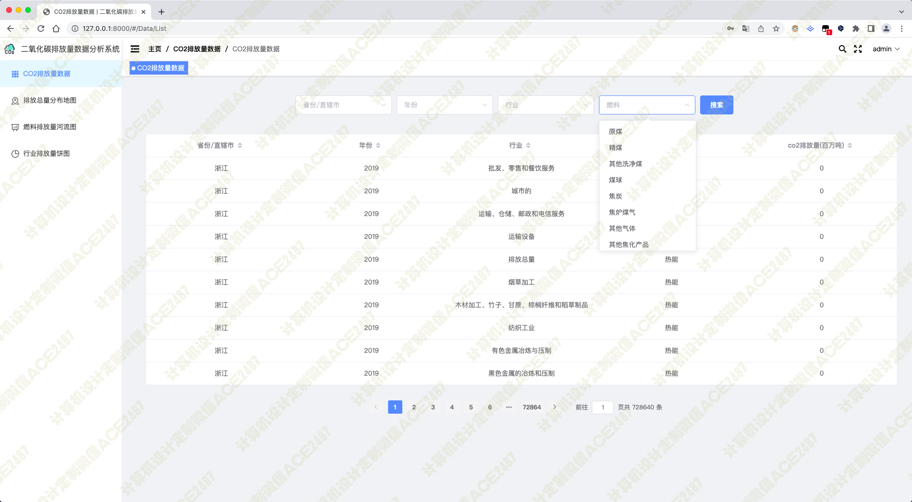
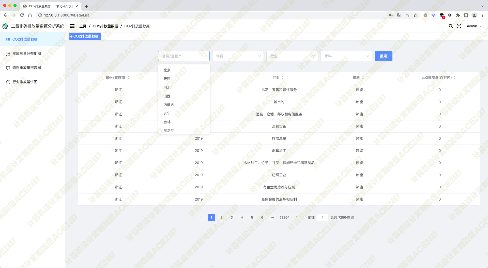
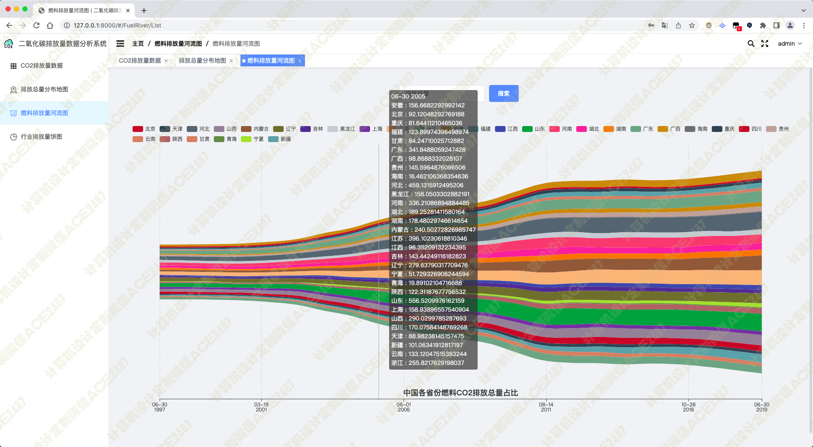
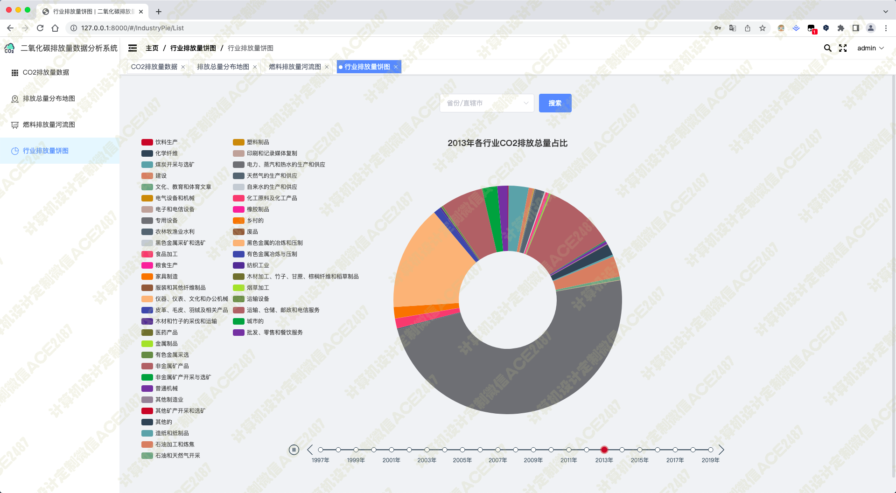
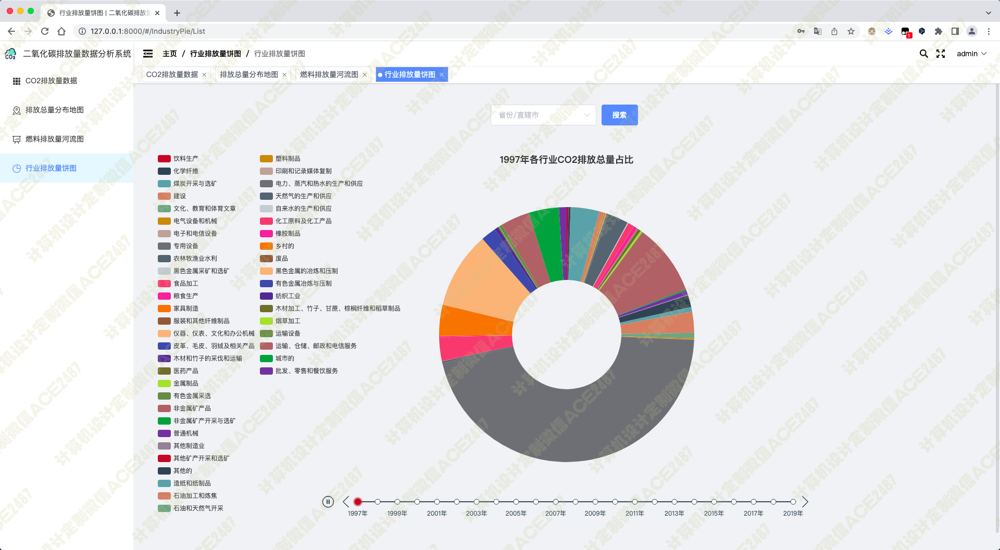
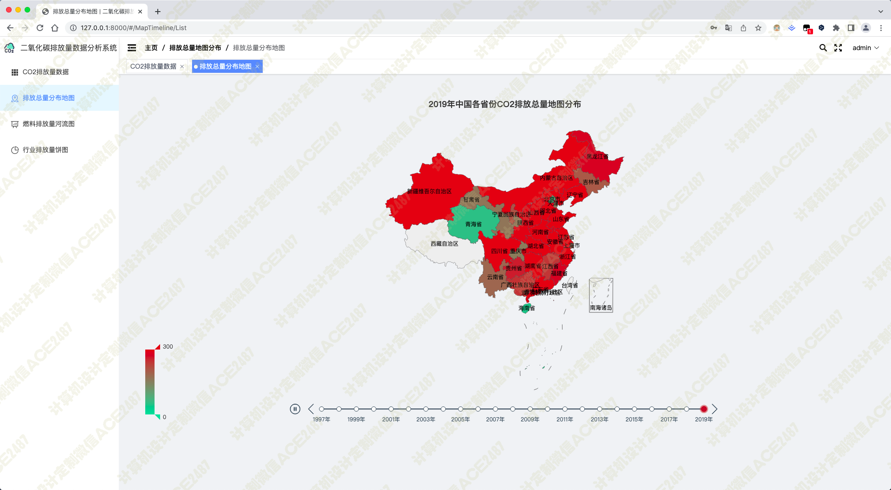
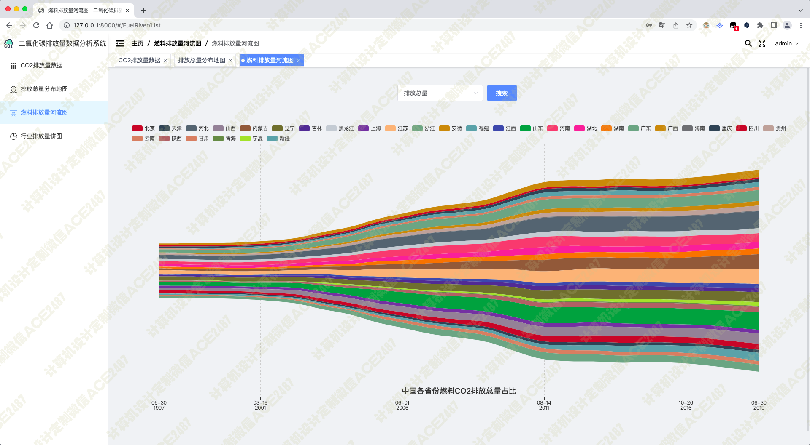
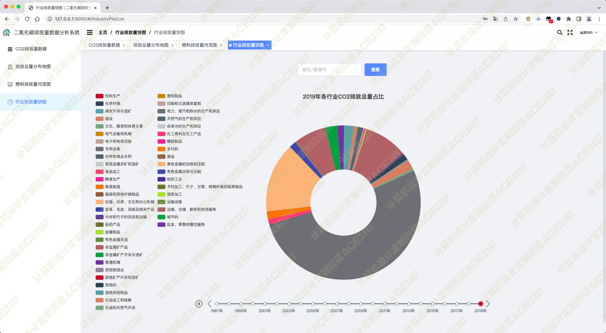
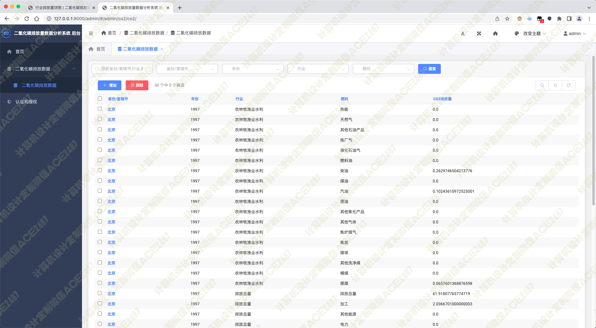
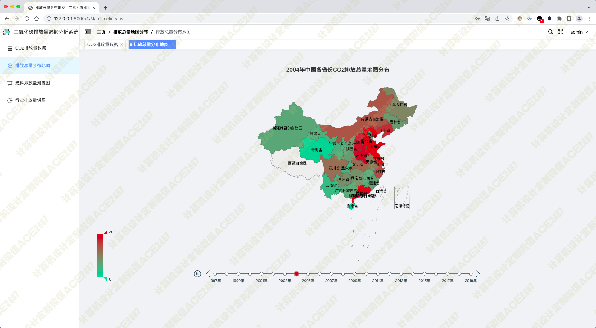
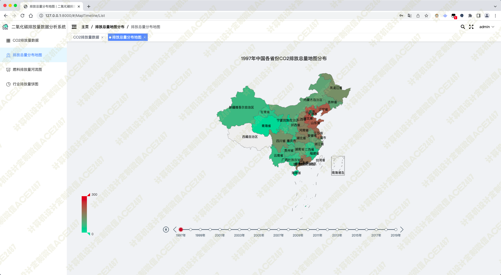
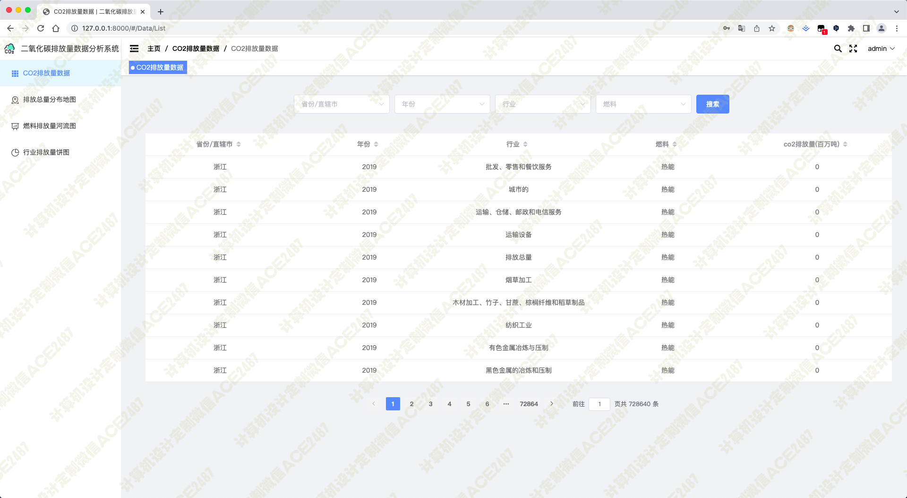
